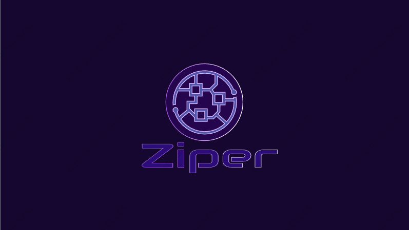

<h1 align="center">
  Ziper P5
</h1>

 

<h2 align="center">
   <u>Project-5-Ziper </u>

## <u>Table of Contents:</u>
+ [User Stories](#user-stories "User Stories")
+ [Database](#database "Database")
+ [Testing](#testing "Testing")
  + [Validator Testing](#validator-testing "Validator Testing")
  
+ [Technologies Used](#technologies-used "Technologies Used")
  + [Main Languages Used](#main-languages-used "Main Languages Used")
  + [Frameworks, Libraries & Programs Used](#frameworks-libraries-programs-used "Frameworks, Libraries & Programs Used")
+ [Deployment](#deployment "Deployment")
+ [Credits](#credits "Credits")
  + [Content](#content "Content")
  + [Media](#media "Media")

## User Experience:
 

 
 ## User Stories:

1. As a user, I would like to be able to:
   
 1.1 Register on the website using my username, email address and password

 1.2 View all posts added on the site

 1.3 View details about all added blog posts

 1.4 View postlist on the navbar

 

2.  As a logged in user, I would like to be able to: 

2.1
   
2.2 

2.3 

2.4 

# Functional Scope:

# Designs

-----

  * Color Pallets 1

----

  * [Color Pallets 2] 
  ----

# Existing Features:

 
 ## Navbar

 

# Future Features:

# Languages Used:

## Frameworks, Libraries & Programs Used

 
  * Figma was used to create the wireframes during the design process
  * Favicon Generator: Used to create favicon used on the website
  * Grammarly: Used to correct any spelling mistakes on readme and app text
  * Git: Gitpod IDE was used for version control by utilizing the Gitpod terminal to commit and Push to GitHub
  * GitHub: GitHub respository is used to store the project's code after being pushed from Gitpod
  * Google Fonts: Google fonts are used to add fonts for aesthetic and UX purposes
  * Django: Framework used to add structure to the platform
  * Bootstrap5: Framework used to add structure and responsiveness
  * AmIResponsive: Used to generate mockup image
 

